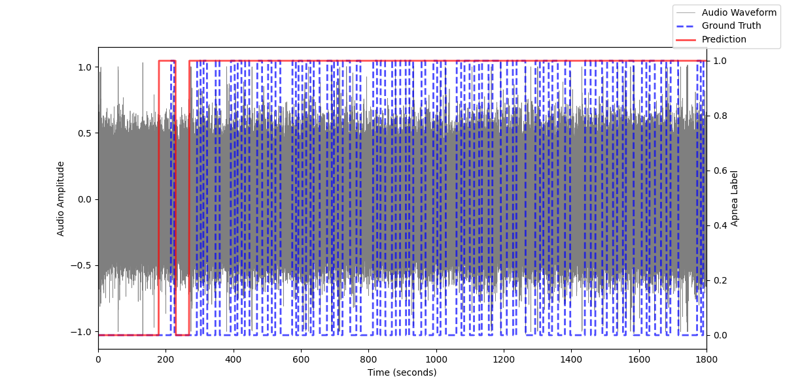
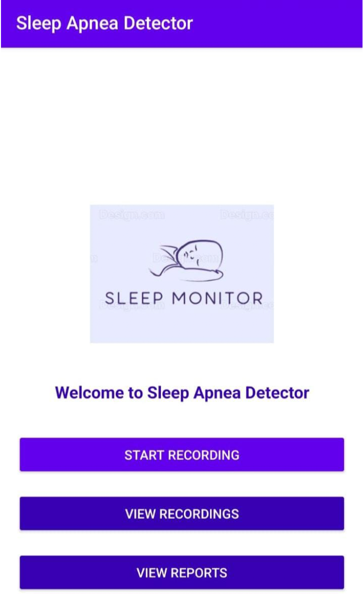

## Team Project - Sleep Apnea Detector

### Introduction

Sleep apnea is a serious sleep disorder that can lead to cardiovascular diseases, cognitive impairments, and excessive daytime drowsiness. Traditional diagnostic methods like polysomnography (PSG) are costly and inconvenient, limiting early detection. This project introduces a deep learning-based mobile application for sleep apnea detection using audio recordings. By extracting spatial and temporal features from spectrogram representations, we leverage a Pretrained Network (VGGish) and an ensemble model combining CRNN, PANNs, and LSTM to improve accuracy. Our goal is to provide a non-invasive, cost-effective, and accessible solution for real-time sleep apnea detection.

### Dataset & Data Pipeline

#### Data Source 

[PSG-Audio Dataset](https://www.nature.com/articles/s41597-021-00977-w)

This comprehensive dataset consists of polysomnography (PSG) data synchronized with high-quality audio recordings.

#### Downloading the Dataset

The `download.py` script in the `data/` folder contains links to automatically download the dataset. 
- `data/links.txt` contains the full list of patients.
- `data/links_clean.txt` contains a cleaned dataset with automatically detected false positive labels, which is used in the current project.

#### Cleaning Audio

- `preprocess_edf.py` and `preprocess_rml.py` extract audio files and apnea annotations.
- `cleaning.py` identifies artifacts, interpolates missing data, and normalizes the audio files.

#### Creating the Dataset

- `create_dataset.py` generates a unified train-test split for binary classification of obstructive sleep apnea using 60-second segments.
- `preprocess_mel.py` precomputes mel spectrograms for each segment.
- `preprocess_vggish.py` extracts embeddings from the pre-trained VGGish model.

### Model Training & Testing

The following models are implemented:
- **Random Forest Algorithm**
- **CNN** (Convolutional Neural Network)
- **LSTM** (Long Short-Term Memory Network)
- **CRNN** (Convolutional Recurrent Neural Network)
- **PANNs** (Pretrained Audio Neural Networks using VGGish)
- **Ensemble Meta-Learning Method**

#### Final Ensemble Model Results (Binary Classification)

| Class      | Precision | Recall | F1-Score |
|------------|-----------|--------|----------|
| No Apnea  | 0.91      | 0.92   | 0.92     |
| Apnea     | 0.95      | 0.94   | 0.94     |
| **Accuracy**  | -         | 0.93   | -        |
| Macro Avg | 0.93      | 0.93   | 0.93     |
| Weighted Avg | 0.93  | 0.93   | 0.93     |

#### Model Testing

`test.py` evaluates the model using a sliding window approach on an unseen recording from the PSG-Audio dataset. The prediction results are shown below:

### Application

The mobile application is developed using Android Studio with Kotlin as the primary programming language. The UI is built using traditional XML layout files. The application source code is located in the `app_code/` directory.

